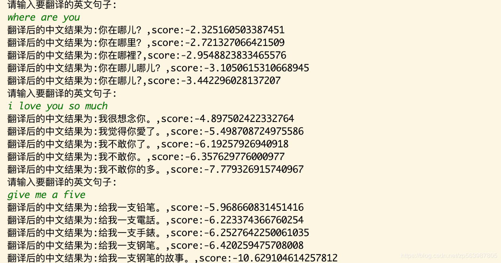

# 基于seq2seq + attention的小型英汉翻译NMT

本文基于PyTorch实现一个小规模数据集的英汉翻译，模型架构使用seq2seq + attention，其中encoder、decoder中使用的双向GRU，attention模式
采用双线性变换attention，模型解码使用beam search，评估使用BLEU指标。

模型训练、评估解码及预测代码在translation.py文件中，对应勾选do_train、do_test、do_translate即可，
模型会自动建立双语词表并保存。

*****本文实现的模型比较简陋，适合学习使用，后续工作在此基础上进行更深入的学习及改进*****

